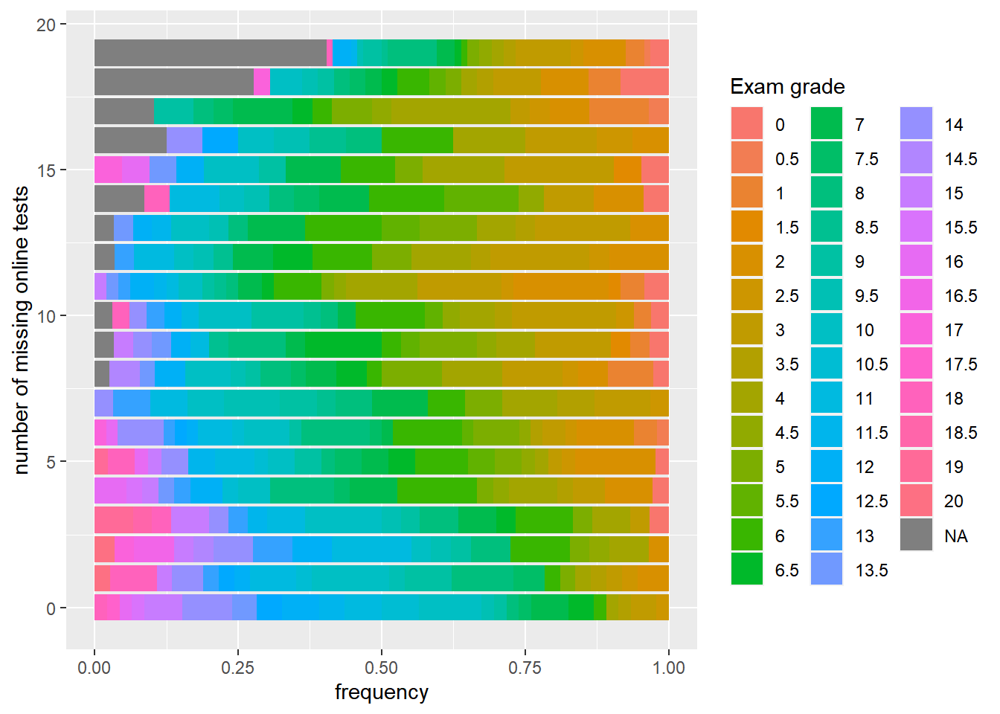

Link to GitHub repository: https://github.com/wuyuntong/r-101-grade-analysis.


::: {.cell}

```{.r .cell-code}
here::i_am("r-101-grade-analysis.Rproj")
library(here)
library(vroom)
library(dplyr)
library(tidyr)
library(ggplot2)
library(stringr)
library(knitr)
```
:::


## Question 1


::: {.cell}

```{.r .cell-code}
grades <- vroom(here("grades.csv"))
```

::: {.cell-output .cell-output-stderr}
```
Rows: 729 Columns: 32
── Column specification ────────────────────────────────────────────────────────
Delimiter: ","
chr  (1): Group
dbl (31): Id, Exam, MCQ_1, MCQ_2, MCQ_3, MCQ_4, MCQ_5, MCQ_6, MCQ_7, MCQ_8, ...

ℹ Use `spec()` to retrieve the full column specification for this data.
ℹ Specify the column types or set `show_col_types = FALSE` to quiet this message.
```
:::
:::


## Question 2


::: {.cell}

```{.r .cell-code}
grades |>
  summarise("max grade" = max(Exam, na.rm = TRUE), "min grade" = min(Exam, na.rm = TRUE), "median grade" = median(Exam, na.rm = TRUE), "mean grade" = mean(Exam, na.rm = TRUE)) |>
  knitr::kable()
```

::: {.cell-output-display}
| max grade| min grade| median grade| mean grade|
|---------:|---------:|------------:|----------:|
|        20|         0|          6.5|   7.148729|
:::
:::


## Question 3


::: {.cell}

```{.r .cell-code}
n_abs <- grades |>
  summarise(n = sum(is.na(Exam)))
```
:::


The number of students who did not take the exam is 60.

## Question 4


::: {.cell}

```{.r .cell-code}
grades |>
  ggplot(aes(x = Exam)) +
  geom_bar(na.rm = TRUE)
```

::: {.cell-output-display}
{width=672}
:::
:::


## Question 5


::: {.cell}

```{.r .cell-code}
grades |>
  group_by(Group) |>
  summarise("number of students" = n()) |>
  knitr::kable()
```

::: {.cell-output-display}
|Group  | number of students|
|:------|------------------:|
|grp_1  |                 29|
|grp_10 |                 23|
|grp_11 |                 25|
|grp_12 |                 33|
|grp_13 |                 29|
|grp_14 |                 32|
|grp_15 |                 34|
|grp_16 |                 33|
|grp_17 |                 35|
|grp_18 |                 36|
|grp_19 |                 29|
|grp_2  |                 23|
|grp_20 |                 33|
|grp_21 |                 36|
|grp_22 |                 27|
|grp_23 |                 33|
|grp_24 |                 35|
|grp_3  |                 32|
|grp_4  |                 32|
|grp_5  |                 27|
|grp_6  |                 23|
|grp_7  |                 31|
|grp_8  |                 30|
|grp_9  |                 29|
:::
:::


## Quesiton 6


::: {.cell}

```{.r .cell-code}
grades |>
  ggplot(aes(y = Group)) +
  geom_bar()
```

::: {.cell-output-display}
{width=672}
:::
:::


# Question 7


::: {.cell}

```{.r .cell-code}
grades |>
  ggplot(aes(y = Group, fill = as.factor(Exam))) +
  geom_bar(position = "fill") +
  scale_fill_discrete(name = "Exam grade") +
  xlab("frequency")
```

::: {.cell-output-display}
{width=672}
:::
:::

::: {.cell}

```{.r .cell-code}
grades |>
  ggplot(aes(y = Exam)) +
  geom_bar(na.rm = TRUE) +
  facet_wrap(~Group)
```

::: {.cell-output-display}
{width=672}
:::
:::


# Question 8


::: {.cell}

```{.r .cell-code}
n_abs1 <- grades |>
  group_by(Group) |>
  summarise("number of absent students" = sum(is.na(Exam)))

n_abs1
```

::: {.cell-output .cell-output-stdout}
```
# A tibble: 24 × 2
   Group  `number of absent students`
   <chr>                        <int>
 1 grp_1                            3
 2 grp_10                           7
 3 grp_11                           6
 4 grp_12                           1
 5 grp_13                           1
 6 grp_14                           1
 7 grp_15                           2
 8 grp_16                           0
 9 grp_17                           5
10 grp_18                           3
# ℹ 14 more rows
```
:::
:::


# Question 9


::: {.cell}

```{.r .cell-code}
n_abs1 |>
  ggplot(aes(y = Group, x = `number of absent students`)) +
  geom_col()
```

::: {.cell-output-display}
{width=672}
:::
:::


# Question 10


::: {.cell}

```{.r .cell-code}
long <- grades |>
  pivot_longer(col = c("Exam", starts_with("MCQ"), starts_with("Online_MCQ")), names_to = "name", values_to = "value")

long
```

::: {.cell-output .cell-output-stdout}
```
# A tibble: 21,870 × 4
      Id Group  name  value
   <dbl> <chr>  <chr> <dbl>
 1   561 grp_16 Exam  10   
 2   561 grp_16 MCQ_1 15   
 3   561 grp_16 MCQ_2 18.5 
 4   561 grp_16 MCQ_3 12.7 
 5   561 grp_16 MCQ_4  8.24
 6   561 grp_16 MCQ_5 13.8 
 7   561 grp_16 MCQ_6 20   
 8   561 grp_16 MCQ_7 20   
 9   561 grp_16 MCQ_8 20   
10   561 grp_16 MCQ_9 20   
# ℹ 21,860 more rows
```
:::
:::


# Question 11


::: {.cell}

```{.r .cell-code}
n_missing_grade <- long |>
  group_by(Id) |>
  summarise("number of missing grades" = sum(is.na(value)))

n_missing_grade
```

::: {.cell-output .cell-output-stdout}
```
# A tibble: 729 × 2
      Id `number of missing grades`
   <dbl>                      <int>
 1     1                         10
 2     2                         15
 3     3                          6
 4     4                          0
 5     5                         19
 6     6                          1
 7     7                         11
 8     8                          4
 9     9                          6
10    10                          3
# ℹ 719 more rows
```
:::
:::


# Question 12


::: {.cell}

```{.r .cell-code}
n_missing_grade |> ggplot(aes(y = `number of missing grades`)) +
  geom_bar()
```

::: {.cell-output-display}
{width=672}
:::
:::


# Question 13


::: {.cell}

```{.r .cell-code}
n_abs2 <- long |>
  filter(name == "Exam") |>
  group_by(Group) |>
  summarise("number of absent students" = sum(is.na(value)))

n_abs2
```

::: {.cell-output .cell-output-stdout}
```
# A tibble: 24 × 2
   Group  `number of absent students`
   <chr>                        <int>
 1 grp_1                            3
 2 grp_10                           7
 3 grp_11                           6
 4 grp_12                           1
 5 grp_13                           1
 6 grp_14                           1
 7 grp_15                           2
 8 grp_16                           0
 9 grp_17                           5
10 grp_18                           3
# ℹ 14 more rows
```
:::
:::


# Question 14


::: {.cell}

```{.r .cell-code}
n_missing_online_tests <- long |>
  filter(str_starts(name, "Online_MCQ")) |>
  group_by(Id) |>
  summarise("number of missing online tests" = sum(is.na(value)))

n_missing_online_tests
```

::: {.cell-output .cell-output-stdout}
```
# A tibble: 729 × 2
      Id `number of missing online tests`
   <dbl>                            <int>
 1     1                                9
 2     2                               14
 3     3                                4
 4     4                                0
 5     5                               19
 6     6                                1
 7     7                               10
 8     8                                3
 9     9                                6
10    10                                3
# ℹ 719 more rows
```
:::
:::


# Question 15


::: {.cell}

```{.r .cell-code}
inner_join(grades, n_missing_online_tests, by = "Id") |>
  ggplot(aes(y = `number of missing online tests`, fill = as.factor(Exam))) +
  geom_bar(position = "fill") +
  scale_fill_discrete(name = "Exam grade") +
  xlab("frequency")
```

::: {.cell-output-display}
{width=672}
:::
:::


# Question 16


::: {.cell}

```{.r .cell-code}
two_col_table1 <- long |>
  filter(str_starts(name, "MCQ")) |>
  group_by(Id) |>
  summarise("Missed" = (sum(is.na(value)) > 0))

two_col_table1
```

::: {.cell-output .cell-output-stdout}
```
# A tibble: 729 × 2
      Id Missed
   <dbl> <lgl> 
 1     1 TRUE  
 2     2 TRUE  
 3     3 TRUE  
 4     4 FALSE 
 5     5 FALSE 
 6     6 FALSE 
 7     7 TRUE  
 8     8 TRUE  
 9     9 FALSE 
10    10 FALSE 
# ℹ 719 more rows
```
:::
:::


# Question 17


::: {.cell}

```{.r .cell-code}
two_col_table2 <- long |>
  filter(str_starts(name, "MCQ")) |>
  group_by(Group, Id) |>
  summarise("Missed" = (sum(is.na(value)) > 0), .groups = "drop_last") |>
  group_by(Group) |>
  summarise("P_missed" = sum(Missed) / n())

two_col_table2
```

::: {.cell-output .cell-output-stdout}
```
# A tibble: 24 × 2
   Group  P_missed
   <chr>     <dbl>
 1 grp_1     0.448
 2 grp_10    0.435
 3 grp_11    0.24 
 4 grp_12    1    
 5 grp_13    0.103
 6 grp_14    0.406
 7 grp_15    0.441
 8 grp_16    0.212
 9 grp_17    0.257
10 grp_18    0.972
# ℹ 14 more rows
```
:::
:::


# Question 18


::: {.cell}

```{.r .cell-code}
grades |>
  group_by(Group) |>
  summarise("Average grade" = mean(Exam, na.rm = TRUE)) |>
  inner_join(two_col_table2, by = "Group") |>
  ggplot(aes(x = P_missed, y = `Average grade`)) +
  geom_point()
```

::: {.cell-output-display}
{width=672}
:::
:::
